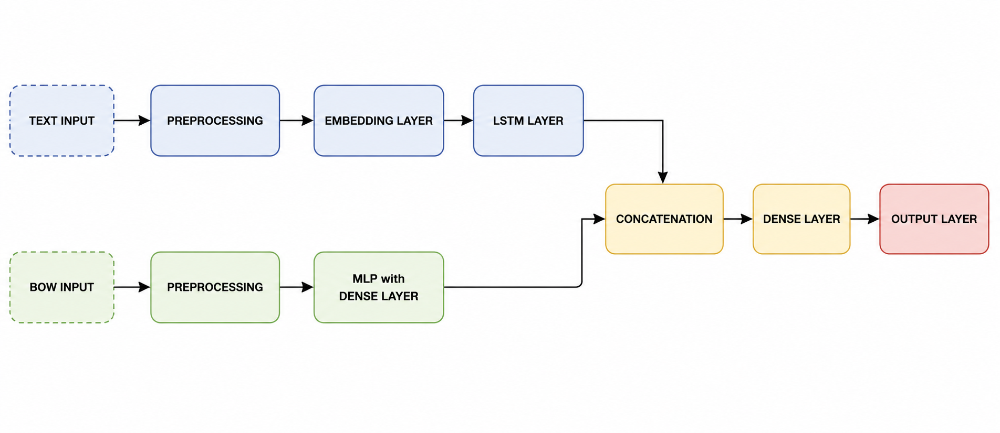
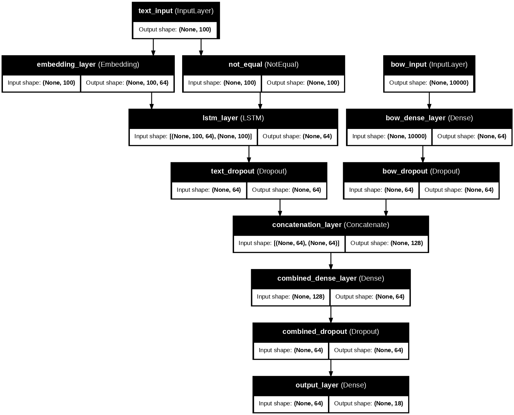

# Deep-Learning-Project


## Multi-Label News Classification with LSTM and Bag-of-Words

This repository contains a deep learning project for **multi-label news classification**.

The objective is to predict one or more semantic categories associated with each news article by combining two different input representations:

- the original textual content of the article;
- a Bag-of-Words representation based on word-frequency information.

The project uses a **multi-input neural network** that combines an LSTM-based branch for sequential text processing with a Dense neural branch for the Bag-of-Words input.

## Project Overview

The task addressed in this project is a **multi-label classification problem**, where each news article may belong to more than one category at the same time.

The model is designed to process two different types of input:

1. **Textual input**, processed through text preprocessing, an Embedding layer and an LSTM layer.
2. **Bag-of-Words input**, processed through Min-Max normalization and a Dense neural branch.

The outputs of the two branches are concatenated and passed through a final Dense layer with sigmoid activation to produce the multi-label predictions.

## Dataset

The dataset contains **11,000 news articles**.

Each sample includes:

- the original news text;
- publication metadata;
- a 10,000-dimensional Bag-of-Words vector;
- an 18-dimensional binary target vector.

Each element of the target vector indicates whether the article belongs to a specific semantic category.

Only the textual component and the Bag-of-Words representation are used as model inputs. Publication year and month are not used because they provide limited semantic information for the classification task.

## Methodology
The project follows these main steps:

1. Dataset inspection and validation of missing or invalid values.
2. Analysis of the target-label distribution.
3. Text preprocessing:
   - lowercasing;
   - punctuation and symbol removal;
   - tokenization;
   - stopword removal;
   - integer encoding;
   - padding.
4. Bag-of-Words preprocessing using Min-Max normalization.
5. Multi-input neural network design.
6. Hyperparameter tuning through a limited Random Search.
7. Final model training with early stopping.
8. Evaluation using metrics suitable for imbalanced multi-label classification.

## Model Architecture

The proposed model is based on two separate input branches.

The first branch processes the textual input:

```text
Text Input → Preprocessing → Embedding Layer → LSTM Layer
```

The second branch processes the Bag-of-Words input:

```text
Bag-of-Words Input → Preprocessing → Dense Layer
```

The two learned representations are then combined:

```text
Concatenation → Dense Layer → Output Layer
```

The following diagram shows the conceptual architecture of the proposed multi-input neural network.



The conceptual diagram highlights how the textual branch and the Bag-of-Words branch are processed separately before being merged through concatenation. The final Dense layers then produce the 18-dimensional multi-label output.

The following graph shows the actual Keras model generated from the implemented architecture.



The Keras graph provides a more detailed view of the implemented layers, input shapes and connections between the two branches.

## Hyperparameter Tuning

The main hyperparameters considered are:

- number of LSTM units;
- number of Dense units;
- dropout rate;
- learning rate;
- batch size.

A limited Random Search is used to compare a small number of reproducible configurations using validation loss. The best configuration is then used to train the final model on the complete training set.

## Evaluation

The final model is evaluated on a held-out test set.

Since this is an imbalanced multi-label classification task, the evaluation focuses on both micro-averaged and macro-averaged metrics:

- Micro Precision;
- Micro Recall;
- Micro F1-score;
- Macro F1-score;
- Binary Accuracy;
- Binary Cross-Entropy.

Binary accuracy is reported as a secondary metric because the target matrix contains many zero values.

The results show that the model achieves good precision, while recall and macro-F1 indicate that some positive and less frequent labels remain more difficult to identify.

## Technologies Used

- Python
- NumPy
- Pandas
- Matplotlib
- Scikit-learn
- TensorFlow
- Keras

## Project Materials

Additional materials for this project are available below.

- **Project Notebook:** Full deep learning pipeline, including data preprocessing, model configuration, training, hyperparameter tuning and evaluation. [Open the notebook](Deep_Learning_Project.ipynb)

- **Conceptual Architecture:** Diagram of the proposed multi-input neural network. [View the architecture](Figures/model_architecture.png)

- **Keras Model Graph:** Model graph generated from the implemented Keras architecture. [View the model graph](Figures/final_model_graph.png)

## Author

Irene Marrali 
BSc in Artificial Intelligence @ Università degli Studi di Milano, Università degli Studi di Pavia, Università degli Studi di Milano-Bicocca


